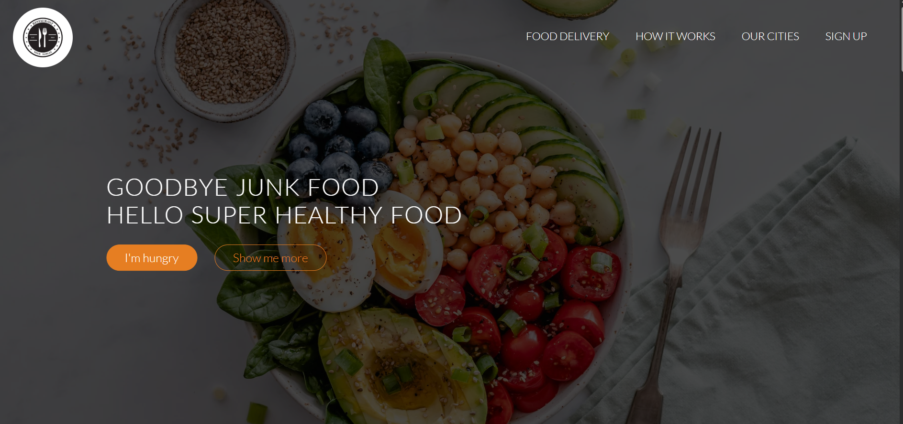
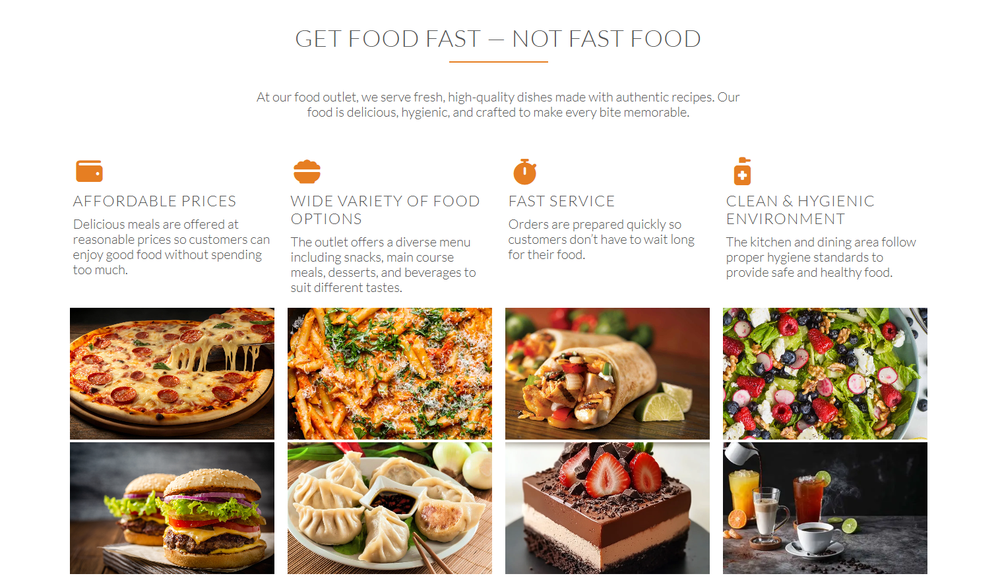
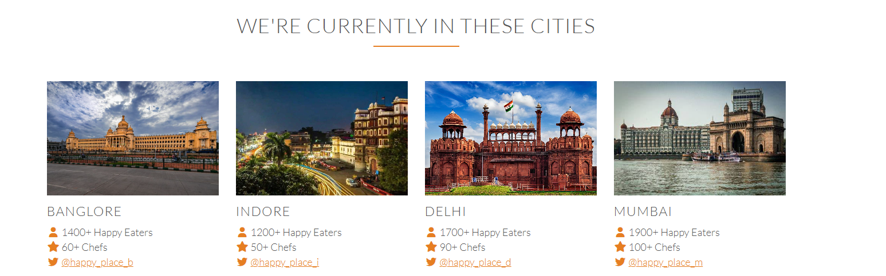
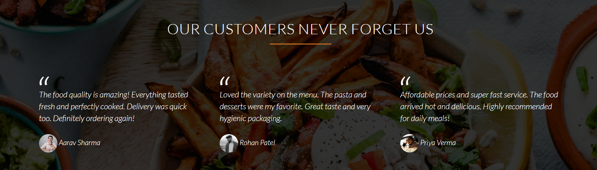

# 🍽️ Happy Place – Restaurant Food Service Website

A responsive restaurant food service website where users can explore meals, view plans, and experience a clean and modern UI.

## 🌐 Live Website
👉 https://kamakshi1210.github.io/happy-place-food-service/

---

## 🚀 Features
- Responsive design (works on mobile, tablet, desktop)
- Smooth scrolling navigation
- Attractive UI with animations (AOS library)
- Food menu showcase with images
- Pricing plans section
- Customer testimonials section
- Contact form

---

## 🛠️ Tech Stack
- HTML5
- CSS3
- JavaScript (jQuery)
- AOS (Animate On Scroll)

---

## 📁 Project Structure
```
happy-place-food-service/
│
├── index.html
├── resources/
│   ├── css/
│   ├── img/
│
├── vendors/
│   ├── css/
```
---

## ▶️ How to Run Locally
1. Download or clone the repository  
2. Open `index.html` in your browser  

---

## 📸 Screenshots






---

## 👩‍💻 Author
**Kamakshi Barskar**